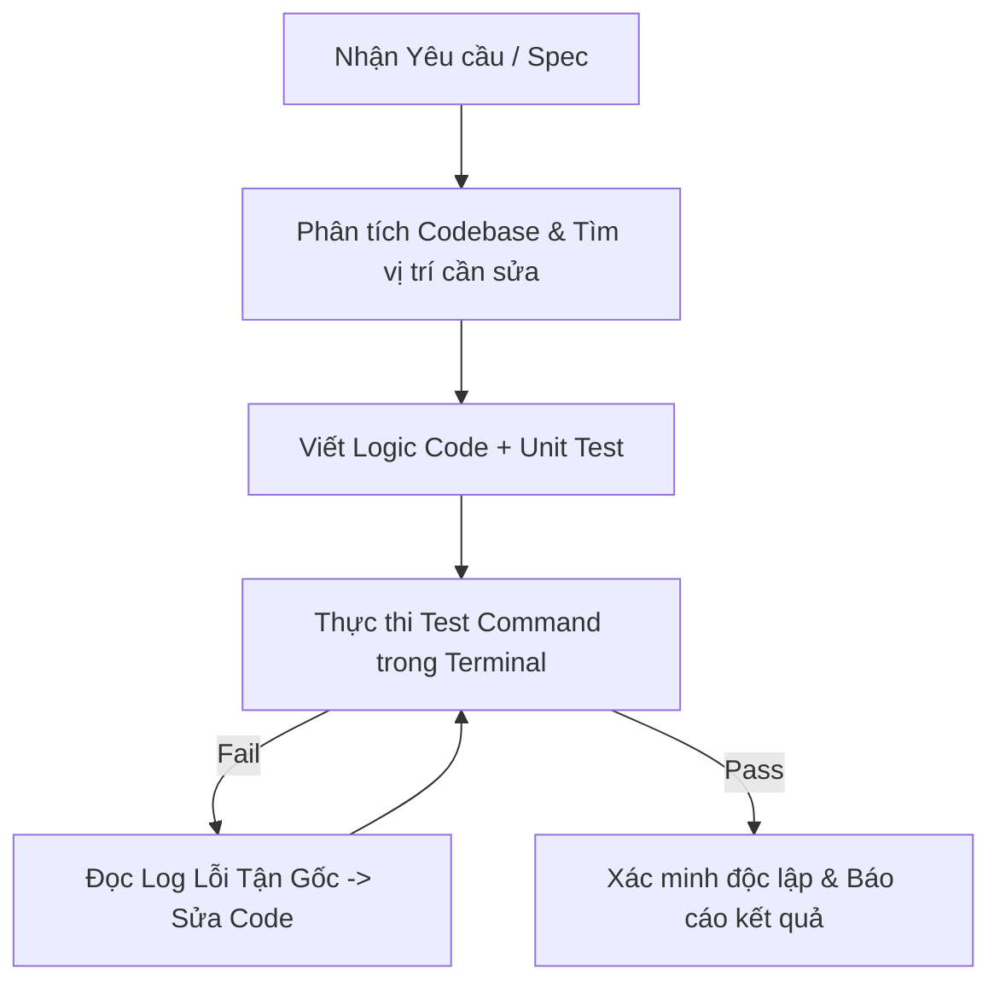

# Dev Executor: Autonomous Coding & Verification Loop

Skill này quy định quy trình làm việc khép kín cho Developer Subagent khi nhận được nhiệm vụ lập trình hoặc sửa bug.

## 🔄 Các Bước Thực Thi
1. **Context Lookup**: Đọc file spec hoặc vị trí code hiện tại. Không bao giờ tự đoán logic hay API signature.
2. **Implementation**: Sửa/tạo code tuân thủ sạch sẽ theo `01-developer-style.md`.
3. **Automated Testing**: Viết unit test và dùng `run_command` chạy trực tiếp lệnh test của dự án (ví dụ: `npm test`, `pytest`, `go test`, `dotnet test`).
4. **Self-Debugging Loop**: Nếu test thất bại, đọc nguyên văn stacktrace, tìm root cause và sửa trực tiếp. lặp lại cho tới khi test thành công 100%.
5. **Completion Report**: Gửi báo cáo gồm code diff, kết quả terminal execution và danh sách test cases đã pass.
