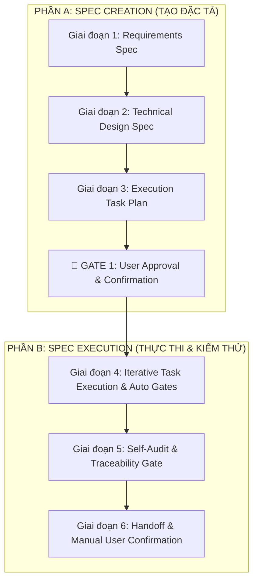
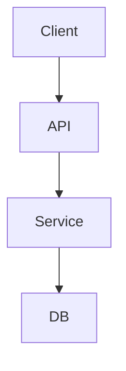
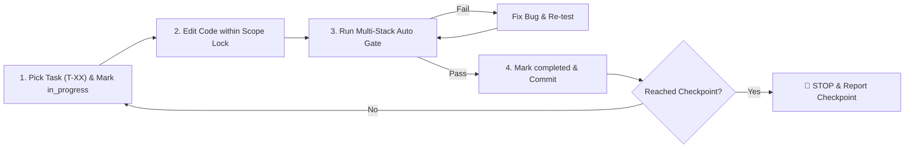

# SKILL: Universal Feature & Architecture Specification & Execution Protocol (`feature-spec`)

## 🎯 Mục đích & Phạm vi

Skill **`feature-spec`** (hợp nhất từ `spec-create` & `spec-run`) là quy trình chuẩn hóa toàn diện từ A-Z dành cho các thay đổi lớn: **tính năng mới, tạo màn hình mới, thay đổi kiến trúc, DB migration, refactor phức tạp, hoặc tác vụ tác động > 5 files**. 

Quy trình bao quát 2 trụ cột chính:
1. **Spec Creation (Tạo đặc tả):** Requirements $\rightarrow$ Technical Design $\rightarrow$ Execution Task Plan.
2. **Spec Execution (Thực thi đặc tả):** Task Run $\rightarrow$ Multi-Stack Verification Gates $\rightarrow$ Checkpoint Audits $\rightarrow$ Delivery & User Manual Confirmation.

---

## 🚦 Ma trận Phân định Quy trình (Skill Decision Matrix)

AI **PHẢI** đối chiếu trước khi bắt đầu công việc:

| Tiêu chí | ⚡ Dùng `quick-fix` | 🏗️ DÙNG `feature-spec` |
| :--- | :--- | :--- |
| **Phạm vi file** | 1 – 5 files | **> 5 files** hoặc ảnh hưởng nhiều module / toàn hệ thống |
| **Bản chất tác vụ** | Fix bug, sửa UI/UX nhỏ, refactor đơn lẻ | **Tính năng mới, Màn hình mới, Module mới, Refactor lớn** |
| **DB & Schema** | Không thay đổi CSDL | **Có thay đổi Schema / DB Migration** |
| **API Contract** | Giữ nguyên API Contract | **Tạo API mới hoặc đứt gãy/thay đổi API Contract cũ** |
| **Quy trình** | Sửa trực tiếp + Verify + Confirm | **Lập Specs 3 giai đoạn $\rightarrow$ Confirm Specs $\rightarrow$ Run Tasks** |

---

## 👥 5 Góc nhìn Vai trò trong Đặc tả & Thực thi (Multi-Role Perspective)

Mọi tính năng lớn khi thiết kế và thực thi PHẢI đảm bảo đầy đủ 5 góc nhìn:

1. 👔 **Quản lý (PM/Scrum Master):** 
   - Phân định rõ In-Scope vs Out-of-Scope.
   - Quản lý Milestone / Checkpoints rõ ràng.
   - Định nghĩa tiêu chuẩn hoàn thành (Definition of Done - DoD).
2. 💻 **Lập trình viên / Kiến trúc sư (Tech Lead / Architect):**
   - Đọc code hiện có trước khi thiết kế (không bịa đặt, tuân thủ pattern/coding style hiện tại).
   - Thiết kế CSDL (Schema & Migration), API Contract (Response transformation matching).
   - Kiểm soát over-engineering: Đơn giản hóa solution, ưu tiên reuse code/component/libraries hiện có trong `package.json` / `pyproject.toml` / `pom.xml` / `build.gradle` / v.v.
3. 🧪 **Tester / QC:**
   - Ma trận Acceptance Criteria (Given-When-Then).
   - Kiểm thử đa tầng (Multi-level verification): Unit test, Lint, Type-check, Integration & Edge cases (null/undefined, network offline, 4xx/5xx).
4. 🎨 **Designer / UX:**
   - Đặc tả giao diện & UI States: Default, Loading, Empty, Error, Disabled, Offline.
   - Cấm hardcode user-facing copy, dùng Localization System / i18n contract đồng bộ cho tất cả ngôn ngữ app hỗ trợ.
5. 🤝 **Khách hàng / Business (Stakeholder):**
   - Đảm bảo giải pháp trực tiếp giải quyết đúng điểm đau (pain point) và mang lại giá trị thực tế.
   - Báo cáo bàn giao minh bạch, dễ hiểu kèm Hướng dẫn Kiểm thử Thủ công (Manual Confirmation Guide).

---

## 🔄 Quy trình 6 Giai đoạn Hợp nhất (`feature-spec`)



---

### 📌 GIAI ĐOẠN 1: REQUIREMENTS (Đặc tả Yêu cầu)

> [!CAUTION]
> **CHECKPOINT XÁC NHẬN YÊU CẦU BAN ĐẦU:**
> Nếu yêu cầu ban đầu của người dùng mập mờ, thiếu thông tin hoặc có nhiều hướng tiếp cận, AI **PHẢI DỪNG LẠI HỎI NGƯỜI DÙNG** (đặt 1-3 câu hỏi trắc nghiệm / lựa chọn kèm gợi ý `Recommended`).

Tạo tài liệu `requirements.md` (lưu trong `.kiro/specs/[feature-name]/requirements.md` hoặc `spec/requirements.md`):

```markdown
# Requirements Spec: [Tên tính năng]

## 👔 1. Bối cảnh & Mục tiêu (Context & Goals - PM Perspective)
- **Bối cảnh:** [Vấn đề kinh doanh / kỹ thuật cần giải quyết]
- **Mục tiêu (Goals):**
  - [ ] Goal 1
  - [ ] Goal 2
- **Không nằm trong phạm vi (Out of Scope):**
  - Item 1 — [Lý do]

## 🛠️ 2. Phạm vi Repository & Module bị ảnh hưởng
- **Repo/Package A:** [Mô tả thay đổi]
- **Repo/Package B:** [Mô tả thay đổi]
- **Cross-repo dependencies:** [Shared types, API contracts, etc.]

## 📖 3. Thuật ngữ (Terminology)
- **Term A:** [Định nghĩa rõ ràng]

## 💻 4. Yêu cầu Chức năng (Functional Requirements - Dev Perspective)
- **FR-01:** System SHALL [Hành vi cụ thể]
- **FR-02:** System SHALL [Hành vi cụ thể]

## 🎨 5. Yêu cầu UI/UX & Localization (Designer Perspective)
- **UX-01:** Màn hình & luồng giao diện bị ảnh hưởng.
- **UX-02:** Trạng thái bắt buộc: Default, Loading, Empty, Error, Disabled, Offline.
- **L10N-01:** TẤT CẢ text hiển thị người dùng PHẢI đi qua localization system. Không hardcode text.

## 🧪 6. Điều kiện Chấp nhận (Acceptance Criteria - QA Perspective)
- **AC-01:** Given [Bối cảnh], When [Hành động], Then [Kết quả kỳ vọng]
- **AC-UI-01:** Given [Trạng thái màn hình], When [Render], Then [Text & UI hiển thị chính xác theo i18n key]
```

---

### 📌 GIAI ĐOẠN 2: TECHNICAL DESIGN (Thiết kế Kỹ thuật & Kiến trúc)

> [!IMPORTANT]
> **ĐỌC CODE TRƯỚC KHI THIẾT KẾ:**
> AI PHẢI đọc code hiện hữu (dùng `view_file` / `grep_search`), ghi lại các file đã review trong `design.md`. Phải kiểm tra dependencies (`package.json`, `pyproject.toml`, `pom.xml`, v.v.), tái sử dụng libraries và components có sẵn, KHÔNG tự thêm dependency mới khi chưa có confirm từ user.

Tạo tài liệu `design.md`:

```markdown
# Technical Design Spec: [Tên tính năng]

## 🔍 1. Codebase Audit (Source Code đã review)
- `path/to/existing_file.ts`: [Ghi nhận coding style, pattern, import convention]
- `dependencies_manifest`: [Danh sách libraries đã có sẵn để tái sử dụng]

## 🏛️ 2. Kiến trúc & Data Flow


## 🗄️ 3. Thiết kế CSDL & Schema Migration
- Tables / Collections mới hoặc chỉnh sửa.
- Schema Migration Plan (hỗ trợ rollback).

## 🔌 4. API Contract & Response Transformation
- Endpoint: `METHOD /api/v1/resource`
- Request Payload schema
- Response Payload schema (Lưu ý match TypeScript Interface với data SAU khi qua API Client auto-transformation).

## 🌐 5. Localization Key Contract (UI Features)
| i18n Key | EN | VI | Usage |
| :--- | :--- | :--- | :--- |
| `feature.title` | Feature Title | Tiêu đề Tính năng | Title component |

## 🛡️ 6. Error Handling & Edge Cases Matrix
- Offline behavior, Network Timeout retry logic.
- Boundary values, Empty lists, 4xx/5xx API Errors.
```

---

### 📌 GIAI ĐOẠN 3: EXECUTION TASK PLAN (Lập Kế hoạch Task Thực thi)

Chia nhỏ công việc thành danh sách các task nhỏ, độc lập, có Checkpoint rõ ràng và **Execution-Ready cho AI Agent**:

Tạo tài liệu `tasks.md`:

```markdown
# Execution Task Plan: [Tên tính năng]

## 📋 Tracking Table
| Task ID | Tên Task | Trạng thái | Checkpoint | Scope Lock (Files) |
| :--- | :--- | :--- | :--- | :--- |
| T-01 | Setup Schema & Entities | ⏳ pending | Checkpoint 1 | `src/models/*` |
| T-02 | Implement API Service | ⏳ pending | Checkpoint 1 | `src/services/*` |
| T-03 | Build UI Screen & i18n | ⏳ pending | Checkpoint 2 | `src/ui/*`, `locales/*` |
| T-04 | Full Integration Test | ⏳ pending | Checkpoint 3 | `tests/*` |

## 📐 Execution Rules & Commit Strategy
- Thực hiện nghiêm ngặt theo thứ tự Checkpoint.
- 1 Task = 1 Commit logic (`feat(...)` / `fix(...)`).
- Chỉ sửa file thuộc `Scope Lock`. Nếu phát sinh file mới, phải update spec trước.
```

---

### 🛑 GATE 1: USER APPROVAL & CONFIRMATION

> [!CAUTION]
> **STOP & WAIT FOR USER APPROVAL:**
> Sau khi tạo xong `requirements.md`, `design.md`, `tasks.md`, AI **PHẢI DỪNG LẠI**, trình bày tóm tắt cho người dùng và CHỜ USER CONFIRM APPROVE mới được chuyển sang Phần B (Spec Execution).

---

### 📌 GIAI ĐOẠN 4: ITERATIVE TASK EXECUTION & AUTO GATES (Thực thi Task & Kiểm thử Tự động)

Khi người dùng duyệt Specs, AI tiến hành thực thi từng task theo quy trình khép kín:



#### 🛡️ Ma trận Kiểm thử Tự động Thích ứng theo Công nghệ (Stack-Agnostic Verification Matrix)

AI tự động phát hiện Stack dự án và chạy bộ lệnh kiểm thử phù hợp sau MỖI TASK:

| Stack / Language | 1. Type Check / Compile | 2. Linter Check | 3. Unit & Regression Test |
| :--- | :--- | :--- | :--- |
| **Node.js / TS** | `npm run type-check` hoặc `npx tsc --noEmit` | `npm run lint` hoặc `npx eslint .` | `npm test` hoặc `npx vitest` / `npx jest` |
| **Python** | `mypy .` hoặc `pyright` | `ruff check .` hoặc `flake8` | `pytest` hoặc `python -m unittest` |
| **Java / Kotlin** | `./gradlew compileJava` / `mvn compile` | `./gradlew checkstyleMain` / `mvn checkstyle:check` | `./gradlew test` / `mvn test` |
| **Go** | `go build ./...` | `golangci-lint run` | `go test ./...` |
| **C# / .NET** | `dotnet build` | `dotnet format --verify-no-changes` | `dotnet test` |
| **Rust** | `cargo check` | `cargo clippy` | `cargo test` |
| **C / C++** | `cmake --build build` / `make` | `clang-tidy` | `ctest` / custom test executable |
| **Swift / iOS** | `swift build` / `xcodebuild build` | `swiftlint` | `swift test` / `xcodebuild test` |
| **PHP / Laravel** | `vendor/bin/phpstan analyze` | `vendor/bin/phpcs` | `vendor/bin/phpunit` hoặc `php artisan test` |

---

### 📌 GIAI ĐOẠN 5: SELF-AUDIT & TRACEABILITY GATE (Tự Đánh giá & Đối chiếu)

Sau khi tất cả các task đã hoàn thành (`completed`), AI **PHẢI TỰ KIỂM TRA LẠI** trước khi báo cáo cho người dùng:

#### 📋 Self-Audit Checklist (AI Gate Keeper)

- [ ] **Requirements Alignment:** Đã đáp ứng 100% Functional Requirements (FR), Non-Functional Requirements (NFR) và Acceptance Criteria (AC) trong `requirements.md` chưa?
- [ ] **UI/UX & Localization Check:** Tất cả text user-facing đã qua localization key chưa? Đã có đủ trạng thái Loading / Empty / Error chưa?
- [ ] **Regression & Risk Analysis:** Thay đổi này có nguy cơ làm đứt gãy API cũ, đứt gãy DB data hiện tại, hay ảnh hưởng đến module khác không?
- [ ] **Clean Code & Over-Engineering Audit:** Không có file debug rác, không có hardcoded secrets, code tuân thủ kiến trúc thiết kế trong `design.md`.

---

### 📌 GIAI ĐOẠN 6: HANDOFF & MANUAL USER CONFIRMATION (Bàn giao & Hướng dẫn Confirm)

Khi Self-Audit hoàn tất, AI xuất báo cáo hoàn thành cho người dùng theo cấu trúc 5 góc nhìn vai trò:

```markdown
🎉 COMPLETED FEATURE DELIVERY REPORT: [Tên tính năng]

## 👔 1. Tóm tắt Quản lý (PM Summary)
- Tất cả N tasks (T-01 đến T-N) thuộc [Feature Name] đã hoàn thành 100%.
- File đặc tả đã cập nhật: `requirements.md`, `design.md`, `tasks.md`.

## 💻 2. Thay đổi Kỹ thuật (Tech & Architecture)
- **Commits:** [Danh sách commits đã tạo]
- **Files modified/added:** [Danh sách files]
- **API & DB:** [Thay đổi Schema/Endpoints nếu có]

## 🧪 3. Kết quả Kiểm thử Tự động (QA Report)
- ✅ Type Check / Compile: PASSED
- ✅ Linter: PASSED
- ✅ Unit & Integration Tests: PASSED (N tests passed)

## 🎨 4. Trạng thái UI/UX & Localization (Designer Report)
- ✅ Localization Keys đã thêm cho đủ ngôn ngữ: `vi`, `en`, ...
- ✅ States UI đã test: Default, Loading, Empty, Error.

## 🤝 5. Hướng dẫn Kiểm thử Thủ công cho Người dùng (Manual Confirmation Guide)

**📌 Mục tiêu kiểm thử:** [Mô tả tính năng cần xác nhận]

**📋 Các bước thực hiện (Step-by-Step):**
1. [Bước 1: Ví dụ khởi động app hoặc chuyển sang màn hình X]
2. [Bước 2: Thực hiện hành động Y]
3. [Bước 3: Thao tác điều kiện biên/lỗi Z (nếu có)]

**🎯 Kết quả kỳ vọng (Expected Results):**
- [ ] Giao diện hiển thị đúng layout và ngôn ngữ người dùng.
- [ ] Logic hoạt động chính xác không báo lỗi.
- [ ] Các trạng thái Loading / Empty / Error hiển thị mượt mà.

👉 **Vui lòng trải nghiệm và xác nhận (Approve) hoặc phản hồi nếu cần điều chỉnh thêm!**
```

---

## 🛠️ Hướng dẫn Kích hoạt Skill

Bạn có thể kích hoạt skill bất kỳ lúc nào bằng các lệnh:
- `/feature-spec` hoặc `Hãy tạo và chạy feature-spec cho tính năng [Tên tính năng]`
- AI sẽ tự động phân tích quy trình 6 giai đoạn và đồng hành cùng bạn.
