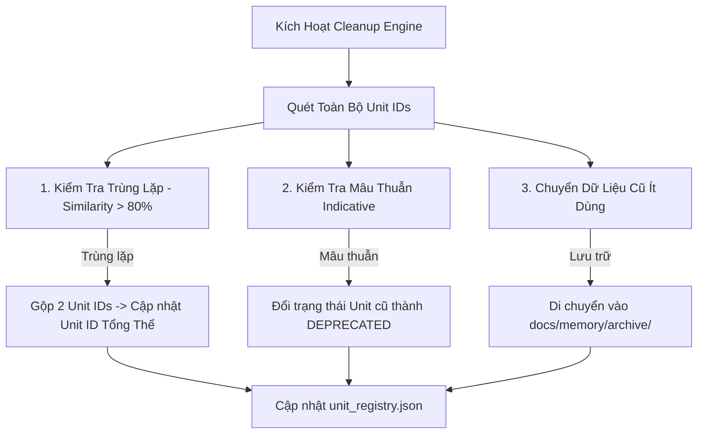

# [SKILL-PRUNE-001] Memory Garbage Collector & Anti-Entropy Engine

Skill này chịu trách nhiệm kiểm soát dung lượng, ngăn chặn tình trạng "Rác dữ liệu" (Data Pollution) và giữ cho toàn bộ Rules/Skills/Memory luôn gọn gàng, không bị phình ra mất kiểm soát.

## 🛡️ 4 Ngưỡng Tự Động Thu Dọn (Cap & Limits Protocol)

| Thành Phần | Ngưỡng Tối Đa (Max Cap) | Hành Động Khi Vượt Ngưỡng |
| :--- | :--- | :--- |
| **File Rules (`.gemini/rules/`)** | tối đa 150 dòng / file | Tự động gộp 3 quy tắc đơn lẻ thành 1 quy tắc tổng quát. |
| **Learned Patterns (`learned_patterns.json`)** | tối đa 30 patterns | Gom nhóm theo cụm (Clustering) và nén các patterns tương đồng. |
| **Active Skills Directory** | Không tạo Skill trùng lặp | Bắt buộc kiểm tra `unit_registry.json` trước khi sinh Skill mới. |

## 🔄 Quy Trình Garbage Collection 4 Bước

### Bước 1: Deduplication & Clustering (Hợp Nhất Tri Thức Trùng)
- So sánh các câu chỉ dẫn trong `learned_patterns.json`.
- Nếu 2 quy tắc có cùng bản chất (ví dụ: *"Dùng camelCase cho biến"* và *"Tên biến phải là camelCase"*), gộp lại làm 1 và đánh dấu Unit ID cũ là `CONSOLIDATED`.

### Bước 2: Conflict Resolution (Xử Lý Mâu Thuẫn)
- Nếu User đưa ra chỉ dẫn mới trái ngược chỉ dẫn cũ (ví dụ: Chuyển từ REST API sang GraphQL), quy tắc cũ lập tức chuyển trạng thái sang `DEPRECATED` và không được nạp vào Prompt nữa.

### Bước 3: Archiving (Lưu Trữ Dữ Liệu Lịch Sử)
- Các file log quá 60 ngày hoặc không còn active sẽ được nén di chuyển vào thư mục `docs/memory/archive/` để giải phóng bộ nhớ chủ động.

### Bước 4: Registry Sync (Cập Nhật Trạng Thái Registry)
- Cập nhật lại file `unit_registry.json` để giữ danh mục luôn chính xác 100%.
