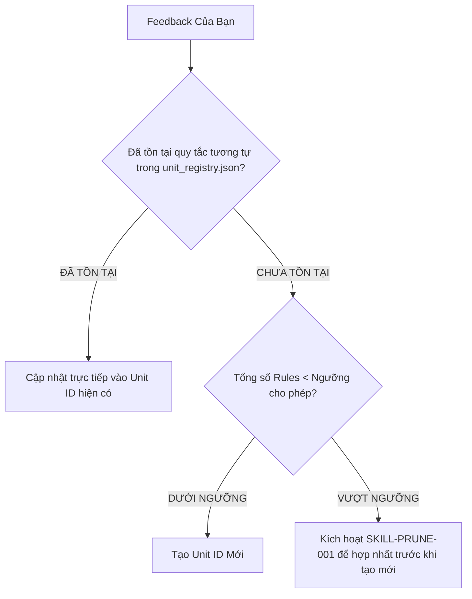

# [SKILL-META-001] Meta-Learner: Deduplication-First Self-Evolving Engine

Skill này đảm bảo tri thức mới được tiếp thu **MỘT CÁCH SẠCH SẼ**, không gây rối hay phình dữ liệu.

## 🛡️ Nguyên Tắc Chống Phình Dữ Liệu (Deduplication First)

Trước khi thêm bất kỳ quy tắc hay bài học mới nào vào hệ thống:

## 🔄 Các Bước Thực Thi Tinh Tế

1. **Similarity Query**: Tìm kiếm trong `unit_registry.json` và `learned_patterns.json` xem đã có Unit ID nào giải quyết vấn đề này chưa.
2. **Merge Over Create**: Ưu tiên chỉnh sửa/bổ sung câu chữ cho Unit ID có sẵn hơn là tạo ra Unit ID mới.
3. **Cap Verification**: Nếu bộ nhớ chạm mốc 30 patterns, tự động chạy `SKILL-PRUNE-001` (`memory-consolidator`) để gom nhóm và nén tri thức trước khi lưu vết.
4. **Registry Confirmation**: Báo cáo phản hồi cho User kèm theo tên Unit ID chính xác đã được cập nhật/gộp.
