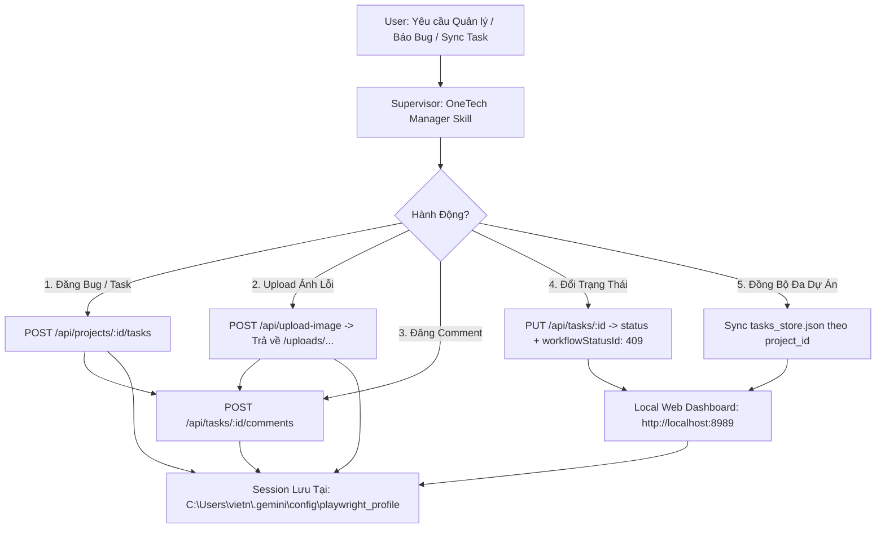

# [SKILL-INT-001] OneTech Workspace Manager

Skill này chuyên trách tự động hóa toàn diện các thao tác trên hệ thống quản lý dự án **OneTech Workspace** (`https://workspace.onetech.vn`), bao gồm:
1. **Truy vấn Đa Dự Án & Sprint:** Nạp danh sách 78+ dự án, truy vấn Sprint live, kiểm tra thành viên dự án (`dinhpl`, `vietnt`, v.v.).
2. **Quản lý Task / Bug / Epic:** Tạo mới task hoặc bug, thiết lập độ ưu tiên, mức độ nghiêm trọng (`severity`), gán người phụ trách (`assigneeId`).
3. **Upload Ảnh & Đính Kèm Comment:** Tải ảnh chụp màn hình lên CDN `/api/upload-image` và tự động nhúng ảnh Markdown vào comment của task (`/api/tasks/:id/comments`).
4. **Cập Nhật Tiến Độ & Workflow Mapping:** Tự động map chính xác `status` và `workflowStatusId` (`405: To Do`, `406: In Progress`, `408: Review`, `409: Done`, `bugStatus: closed`).
5. **Đồng Bộ Dữ Liệu An Toàn:** Lưu trữ tập trung tại [`d:\ITGVietAssistant\data\tasks_store.json`](file:///d:/ITGVietAssistant/data/tasks_store.json), bảo toàn 100% lịch sử trao đổi và ghi chú giải pháp giữa các lần đồng bộ.



---

## 🛠️ Cấu Trúc Bộ Công Cụ (Scripts)

Toàn bộ mã nguồn nằm tại:  
📁 `C:\Users\vietn\.gemini\config\skills\onetech-workspace-manager\scripts\`

### 1. `onetech_client.py` (`OneTechClient`)
Lớp Python điều khiển trình duyệt headless Chromium với persistent session:
* `get_projects()`: Lấy danh sách toàn bộ dự án user có quyền truy cập.
* `get_sprints(project_id)`: Lấy danh sách Sprints của dự án cụ thể.
* `get_members(project_id)`: Tra cứu danh sách thành viên dự án (tìm user ID như `dinhpl`).
* `get_tasks(project_id, sprint_id, assignee_id)`: Lọc danh sách tasks.
* `create_task(project_id, payload)`: Tạo Task / Bug / Epic / Story mới.
* `update_task(task_id, payload)`: Cập nhật task (tự động map `workflowStatusId` và `bugStatus`).
* `upload_image(image_path)`: Tải ảnh từ ổ đĩa lên máy chủ OneTech, trả về URL `/uploads/...`.
* `add_comment(task_id, content, author_id)`: Đăng comment kèm Markdown/ảnh vào task.
* `sync_to_local_store(project_id, user_id, project_name)`: Đồng bộ bảo toàn dữ liệu vào local store.

---

## 💻 Hướng Dẫn Sử Dụng Nhanh (CLI Commands)

### 1. Xem danh sách dự án:
```powershell
python C:\Users\vietn\.gemini\config\skills\onetech-workspace-manager\scripts\cli.py projects
```

### 2. Đồng bộ tasks của dự án hiện tại về máy:
```powershell
python C:\Users\vietn\.gemini\config\skills\onetech-workspace-manager\scripts\cli.py sync --project 82
```

### 3. Tạo Bug mới, gán cho thành viên khác kèm ảnh minh họa:
```powershell
python C:\Users\vietn\.gemini\config\skills\onetech-workspace-manager\scripts\cli.py create `
  --project 82 `
  --sprint 79 `
  --type bug `
  --priority high `
  --severity major `
  --assignee dinhpl `
  --title "[CMS] Issue popup is overlapped by panel" `
  --description "Mô tả chi tiết lỗi..." `
  --image "C:\path\to\screenshot.png"
```

### 4. Đăng comment kèm ảnh vào Task đã có:
```powershell
python C:\Users\vietn\.gemini\config\skills\onetech-workspace-manager\scripts\cli.py comment 8276 `
  --message "Ảnh chụp màn hình cập nhật sau khi tái hiện lỗi:" `
  --image "C:\path\to\new_evidence.png"
```

### 5. Đổi trạng thái Task (Tự động map Workflow Status):
```powershell
# Chuyển sang DONE (Tự động set workflowStatusId: 409 và bugStatus: closed)
python C:\Users\vietn\.gemini\config\skills\onetech-workspace-manager\scripts\cli.py update 8086 --status done

# Chuyển sang IN PROGRESS (workflowStatusId: 406)
python C:\Users\vietn\.gemini\config\skills\onetech-workspace-manager\scripts\cli.py update 8274 --status in_progress
```

---

## 🔒 Cơ Chế Xác Thực & Quản Lý Phiên (Session)

* **Vị trí Profile lưu phiên:** `C:\Users\vietn\.gemini\config\playwright_profile`
* Client tự động tái sử dụng phiên đã đăng nhập, chạy hoàn toàn **headless 100% ngầm** trong nền mà không yêu cầu user nhập lại mật khẩu.
* Hỗ trợ tải dữ liệu siêu tốc, tương thích hoàn toàn với Web Task Dashboard tại **`http://localhost:8989`**.
