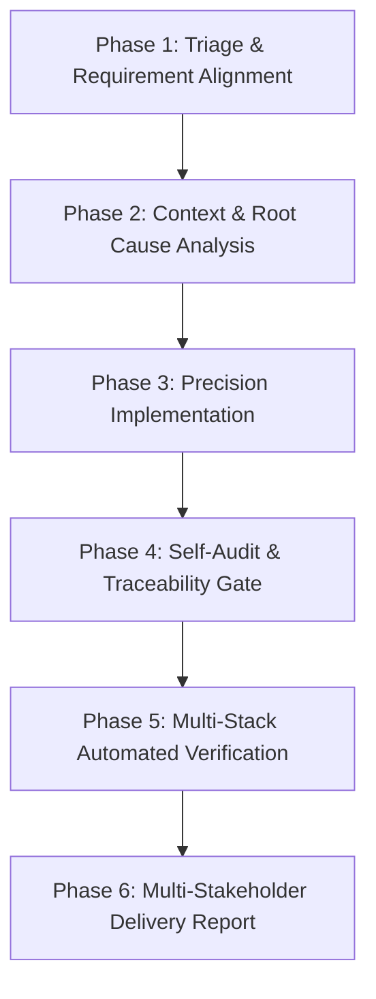

# SKILL: Universal Quick Fix & Rapid Improvement Protocol

## 🎯 Mục đích & Phạm vi

Skill này quy định quy trình xử lý chuẩn hóa cho các tác vụ **Quick Fix & Cải tiến nhanh** (sửa lỗi, chỉnh sửa hành vi, tinh chỉnh UI, refactor nhỏ). Quy trình thiết kế theo chuẩn **Multi-Perspective & Multi-Stack AI Workflow** nhằm giúp mọi AI Coding Agent (Antigravity, Claude, Cursor, Codex, Copilot...) tự động tuân thủ nguyên tắc chất lượng cao nhất trên **BẤT KỲ NGÔN NGỮ / TECH STACK NÀO** mà không bị quá tải bởi các quy trình spec rườm rà.

---

## 🚦 Ma trận Quyết định Scope (Scope Decision Matrix)

AI **PHẢI** kiểm tra điều kiện trước khi thực hiện tác vụ:

| Tiêu chí | ✅ Dùng `quick-fix` | 🛑 CHUYỂN SANG FEATURE SPEC (`feature-spec`) |
| :--- | :--- | :--- |
| **Số lượng file thay đổi** | Tối đa **1–5 files** | > 5 files hoặc thay đổi nhiều layer |
| **Bản chất tác vụ** | Fix bug cụ thể, sửa logic sai, UI tweak, minor UX | Thêm tính năng mới, tạo màn hình mới |
| **Cơ sở dữ liệu / Schema** | Không đổi schema / DB migration | Có DB Migration / Thay đổi Schema |
| **API Contract** | Giữ nguyên API Contract / Function Signature | Đổi Breaking API Contract |
| **Rủi ro ảnh hưởng** | Cục bộ (Local scope) | Toàn hệ thống (System-wide impact) |

---

## 👥 5 Góc nhìn Vai trò Cốt lõi (Multi-Role Perspectives)

Mọi thay đổi code của AI phải đáp ứng đồng thời 5 tiêu chuẩn vai trò:

```
                  ┌────────────────────────────────────────┐
                  │ 👔 1. QUẢN LÝ (Project Manager / PM)  │
                  │ Scope Lock • DoD • Zero Scope Creep    │
                  └──────────────────┬─────────────────────┘
                                     │
    ┌────────────────────────────────┼────────────────────────────────┐
    │                                │                                │
┌───┴───────────────────────┐ ┌──────┴──────────────────────┐ ┌───────┴──────────────────────┐
│ 💻 2. LẬP TRÌNH VIÊN      │ │ 🧪 3. TESTER / QC           │ │ 🎨 4. DESIGNER / UX          │
│ Root Cause • Minimal Diff │ │ Regression Check • Proof    │ │ Visual & UX Consistency      │
└───────────────────────────┘ └─────────────────────────────┘ └──────────────────────────────┘
                                     │
                  ┌──────────────────┴─────────────────────┐
                  │ 🤝 5. KHÁCH HÀNG / STAKEHOLDER         │
                  │ Business Value • Transparent Report    │
                  └────────────────────────────────────────┘
```

1. 👔 **Quản lý (PM/Scrum Master):** Khóa phạm vi (Scope Lock), đảm bảo hoàn thành nhanh, không "tiện tay" sửa lan sang phần khác (Scope Creep), báo cáo tiến độ minh bạch.
2. 💻 **Lập trình viên (Developer/Tech Lead):** Phân tích nguyên nhân gốc (Root Cause First), không "vá víu" triệu chứng (No Symptom Patching), giữ nguyên kiến trúc và style code của dự án.
3. 🧪 **Tester / QC:** Đảm bảo không nảy sinh lỗi cũ (Zero Regression), tự kiểm thử bằng bằng chứng thực tế (Empirical Proof), kiểm tra các trường hợp biên (Edge cases).
4. 🎨 **Designer / UX:** Đảm bảo tính nhất quán giao diện (Visual & UX Consistency), phản hồi mượt mà, không làm vỡ layout responsive hay màu sắc chuẩn của Design System.
5. 🤝 **Khách hàng (Stakeholder):** Đảm bảo giá trị sử dụng không bị ảnh hưởng tiêu cực, nhận báo cáo dễ hiểu bằng ngôn ngữ tự nhiên (non-technical summary).

---

## 🔄 Quy trình 6 Bước Thực thi AI (6-Phase Execution Pipeline)



---

### 📍 PHASE 1: Triage, Scope Lock & Requirement Alignment (Phân loại & Xác nhận Yêu cầu)

AI tự động xác định loại tác vụ, thiết lập ranh giới và xác nhận yêu cầu với người dùng:

1. **Phân loại tác vụ:**
   - 🐛 **Bug Fix:** Lỗi crash, logic sai, tính toán sai.
   - 🔧 **Code Repair:** Lỗi type error, linter, import hỏng, deprecation.
   - 🎨 **UI/UX Tweak:** Chỉnh style, layout, responsive, spacing, text.
   - ♻️ **Micro Refactor:** Tối ưu hiệu năng nhỏ, đơn giản hóa đoạn code rối (dưới 100 dòng).
2. **Thiết lập ranh giới (Scope Boundary):**
   - Xác định danh sách các file được phép sửa (Target Files).
   - Đánh dấu các file **CẤM** đụng vào để tránh side-effect.
3. **Xác nhận & Làm rõ Yêu cầu (Requirement Alignment Checkpoint):**
   - **Trường hợp A (Yêu cầu rõ ràng, đủ thông tin):** Tóm tắt ngắn gọn ranh giới công việc và tự động chuyển sang Phase 2.
   - **Trường hợp B (Yêu cầu mập mờ, thiếu thông tin hoặc có nhiều phương án giải quyết):**
     > [!CAUTION]
     > **CẤM ĐOÁN MỜ & CẤM TỰ SỬA KHI THIẾU THÔNG TIN:**
     > AI **PHẢI DỪNG LẠI HỎI NGƯỜI DÙNG** để làm rõ trước khi đụng vào code.
     - Đặt tối đa 1–3 câu hỏi tập trung.
     - Luôn đưa ra gợi ý giải pháp Khuyên dùng (`(Recommended)`) kèm ưu/nhược điểm ngắn gọn để người dùng lựa chọn nhanh.

---

### 📍 PHASE 2: Deep Context & Root Cause Analysis (Điều tra Nguyên nhân Gốc)

> [!IMPORTANT]
> **TẮT CƠ CHẾ ĐOÁN MỜ / MASKING SYMPTOM:**
> Không bao giờ sửa code khi chưa đọc hiểu file thực tế. Không sử dụng try-catch rỗng để nuốt lỗi hay trả về dummy fallback.

1. **Thu thập thông tin:**
   - Đọc kỹ log lỗi, stack trace, hoặc mô tả bug của người dùng.
   - Đọc các file liên quan bằng lệnh xem file đầy đủ (không đọc lướt 15-20 dòng đầu).
2. **Xác định Root Cause Matrix:**
   - **Hiện tượng (Symptom):** [Lỗi hiển thị hoặc crash như thế nào?]
   - **Nguyên nhân gốc (Root Cause):** [Dòng code nào, hàm nào, hoặc logic nào thực sự gây ra lỗi?]
   - **Rủi ro tiềm ẩn (Risk):** [Thay đổi này có thể tác động đến component/module nào khác?]

---

### 📍 PHASE 3: Precision Implementation (Sửa Code Chính xác)

1. **Nguyên tắc sửa code:**
   - **Minimal Diff:** Chỉ sửa đúng những dòng code cần thiết để khắc phục Root Cause.
   - **Pattern Matching:** Tuân thủ 100% naming convention, indent, import pattern và coding style hiện có của dự án.
   - **No Unused Code:** Không để lại `console.log`, `print()`, code comment thừa, hoặc import không dùng.
2. **Thực thi:**
   - Thực hiện chỉnh sửa bằng các khối edit tập trung.

---

### 📍 PHASE 4: Self-Audit & Requirements Traceability Gate (Tự Review & Đối chiếu Yêu cầu)

> [!IMPORTANT]
> **QUY TẮC TỰ KIỂM TRA TRƯỚC KHI VERIFY:**
> Sau khi sửa code xong, AI **KHÔNG ĐƯỢC TUYÊN BỐ HOÀN THÀNH NGAY**. AI phải đóng vai **Senior Code Reviewer / QC Lead** để tự đánh giá lại toàn bộ diff vừa tạo theo 4 ma trận kiểm định:

1. **Đối chiếu Yêu cầu Ban đầu (Requirements Traceability Matrix):**
   - Rà soát lại 100% các mục yêu cầu trong lời gọi của người dùng / ticket (kể cả các câu trả lời làm rõ ở Phase 1).
   - ❓ *Từng yêu cầu đã được đáp ứng đầy đủ chưa? Có mục nào bị bỏ sót hay làm sai lệch không?*

2. **Tự Code Review (`git diff` Self-Review):**
   - Đọc lại toàn bộ đoạn code vừa thay đổi.
   - ❓ *Có để lại `console.log`, `print()`, code comment rác hoặc import dư thừa không?*
   - ❓ *Có đoạn code nào tiềm ẩn rủi ro NullPointer / KeyError / ReferenceError / Memory Leak không?*
   - ❓ *Có tuân thủ chuẩn đặt tên và phong cách lập trình của file hiện tại không?*

3. **Phân tích Tác động & Rủi ro Side-Effect (Impact & Risk Assessment):**
   - ❓ *Thay đổi này tác động trực tiếp/gián tiếp đến các hàm, component hay API nào khác đang gọi nó?*
   - ❓ *Có làm thay đổi hành vi (behavior) của các tính năng không liên quan khác không?*

4. **Kịch bản Trường hợp Biên (Edge-Case Checklist):**
   - ❓ *Đã xử lý an toàn các trường hợp dữ liệu rỗng (`null`, `undefined`, `[]`, `""`) chưa?*
   - ❓ *Đã xử lý trường hợp mạng chậm / timeout / lỗi HTTP status (4xx, 5xx) chưa?*

---

### 📍 PHASE 5: Multi-Stack Automated Verification Gate (Kiểm thử Tự động Đa Hệ thống)

AI **BẮT BUỘC** tự động phát hiện Tech Stack của dự án và chạy các lệnh kiểm thử tương ứng.

#### 🔍 1. Quy tắc Tự động Phát hiện Stack (Stack Auto-Discovery):
AI kiểm tra các file cấu hình dự án để chọn câu lệnh kiểm thử:
- Có `Makefile` / `scripts/test.sh` $\rightarrow$ Ưu tiên chạy `make test` / `bash scripts/test.sh`.
- Có `package.json` $\rightarrow$ Stack **Node.js / TS / React / Next.js / Vue**.
- Có `pyproject.toml` / `requirements.txt` / `manage.py` $\rightarrow$ Stack **Python / Django / FastAPI**.
- Có `build.gradle` / `pom.xml` $\rightarrow$ Stack **Java / Kotlin / Spring Boot / Android**.
- Có `*.csproj` / `*.sln` $\rightarrow$ Stack **C# / .NET / Unity**.
- Có `go.mod` $\rightarrow$ Stack **Go (Golang)**.
- Có `Cargo.toml` $\rightarrow$ Stack **Rust**.
- Có `CMakeLists.txt` / `Makefile` $\rightarrow$ Stack **C / C++**.
- Có `*.xcodeproj` / `*.xcworkspace` $\rightarrow$ Stack **iOS / Swift**.
- Có `composer.json` $\rightarrow$ Stack **PHP / Laravel**.

#### 🧪 2. Ma trận Lệnh Kiểm thử Theo Tech Stack:

| Tech Stack / Ecosystem | 1. Biên dịch & Type-Check | 2. Linter & Static Analysis | 3. Unit & Regression Test |
| :--- | :--- | :--- | :--- |
| **Node.js / TS / React / Next / Vue** | `npm run type-check` (hoặc `tsc --noEmit`) | `npm run lint` (hoặc `npx eslint .`) | `npm test` (hoặc `npx vitest` / `jest`) |
| **Python (Django / FastAPI / Flask)** | `mypy .` (hoặc `pyright`) | `ruff check .` (hoặc `flake8`) | `pytest` (hoặc `python manage.py test`) |
| **Java / Kotlin (Spring / Android)** | `./gradlew compileJava` (hoặc `mvn compile`) | `./gradlew checkstyle` (hoặc `mvn spotbugs:check`) | `./gradlew test` (hoặc `mvn test`) |
| **C# / .NET (ASP.NET / Unity)** | `dotnet build` | `dotnet format --verify-no-changes` | `dotnet test` |
| **Go (Golang)** | `go build ./...` | `go vet ./...` (hoặc `golangci-lint run`) | `go test -v ./...` |
| **Rust** | `cargo check` | `cargo clippy` | `cargo test` |
| **C / C++** | `cmake --build build` (hoặc `make`) | `cppcheck .` (hoặc `clang-tidy`) | `ctest` |
| **iOS / Swift** | `xcodebuild build` | `swiftlint` | `xcodebuild test` |
| **PHP (Laravel / Symfony)** | `vendor/bin/phpstan` | `vendor/bin/phpcs` | `php artisan test` (hoặc `phpunit`) |

#### 🔄 3. Vòng lặp Tự sửa Lỗi Kiểm thử (Auto-Remediation Loop):
Nếu bất kỳ lệnh verify nào thất bại (Exit Code $\neq$ 0):
1. AI đọc trực tiếp log lỗi thực tế.
2. Phân tích và điều chỉnh code theo đúng Root Cause.
3. Chạy lại lệnh verify đến khi đạt **100% Pass / Green**.

#### 📱 4. Kịch bản Kiểm thử Thủ công Bắt buộc (Manual Verification Protocol):
> [!IMPORTANT]
> **QUY TẮC BẮT BUỘC ĐỐI VỚI TÁC VỤ UI/UX HOẶC FLOW NGƯỜI DÙNG:**
> Khi tác vụ có tương tác trực tiếp của người dùng hoặc thuộc các nhóm sau:
> - 🎨 **UI/UX Tweak:** Đổi style, layout, responsive, màu sắc, font chữ, spacing.
> - 🔄 **User Flow / Modal / Popup / Navigation:** Thêm/sửa form, popup chọn danh mục, flow wizard, chuyển màn hình.
> - 📱 **Frontend / Mobile App / Web UI:** Bất kỳ thay đổi nào hiển thị lên giao diện.
> - 🔌 **End-to-End Integration:** Tích hợp dữ liệu giữa App và Web/CMS cần kiểm tra đối chiếu.
>
> AI **BẮT BUỘC** phải cung cấp **Hướng dẫn Kiểm thử Thủ công (Manual Verification Steps)** chi tiết trong Báo cáo Bàn giao (Phase 6), bao gồm:
> 1. **Mục tiêu & Điều kiện kiểm thử:** Môi trường, tài khoản, màn hình kiểm tra.
> 2. **Các bước thao tác từng bước (Step-by-step):** Đánh số rõ ràng (Bước 1, Bước 2, Bước 3...).
> 3. **Kết quả kỳ vọng chi tiết (Expected Result):** Cho từng thao tác, nêu rõ điểm khác biệt sau khi fix.
> 4. **Các trường hợp ngoại lệ cần thử (Negative / Edge Cases):** Hủy popup, bỏ trống trường bắt buộc, mạng yếu, v.v.

---

### 📍 PHASE 6: Multi-Stakeholder Delivery Report (Báo cáo Bàn giao)

Sau khi hoàn thành và verify thành công, AI tổng hợp báo cáo đa góc nhìn cho người dùng:

```markdown
### 📋 BÁO CÁO HOÀN THÀNH (QUICK FIX REPORT)

#### 👔 1. Quản lý (Scope & DoD)
- **Tech Stack:** [Node.js / Python / Java / Go / C# / C++ / Rust / Swift / PHP]
- **Loại tác vụ:** [Bug Fix / UI Tweak / Refactor / Code Repair]
- **Danh sách file đã sửa:** `[file_path_1]`, `[file_path_2]`
- **Trạng thái:** ✅ Hoàn thành đúng Scope, không đụng vào module ngoài.

#### 💻 2. Lập trình viên (Technical Summary & Self-Audit)
- **Root Cause:** [Mô tả ngắn gọn nguyên nhân gốc rễ kỹ thuật]
- **Giải pháp:** [Giải pháp kỹ thuật đã áp dụng]
- **Kết quả Tự Review Code:** ✅ Đã đọc lại `git diff`, dọn dẹp rác/log thừa, đảm bảo no-side-effect.

#### 🧪 3. Tester / QC (Verification Evidence & Traceability)
- **Đối chiếu Yêu cầu:** 100% yêu cầu ban đầu đã được đáp ứng.
- **Kiểm thử tự động:**
  - Build/Type-check: Pass ✅
  - Lint/Static Analysis: Pass ✅
  - Unit/Regression test: Pass ✅
- **Edge cases đã rà soát:** [Ví dụ: null/undefined, mạng chậm, dữ liệu rỗng...]
- **📱 Hướng dẫn Kiểm thử Thủ công (Manual Verification Steps):**
  - **Môi trường & Điều kiện:** [Thiết bị/Trình duyệt, màn hình, tài khoản...]
  - **Bước 1:** [Thao tác mở màn hình/popup...] $\rightarrow$ *Kỳ vọng:* [Hiển thị đúng...]
  - **Bước 2:** [Thao tác tương tác với tính năng đã fix...] $\rightarrow$ *Kỳ vọng:* [Hành vi đúng như yêu cầu...]
  - **Bước 3:** [Thao tác lưu/submit/đối chiếu dữ liệu...] $\rightarrow$ *Kỳ vọng:* [Dữ liệu lưu chuẩn xác, không lỗi...]
  - **Trường hợp ngoại lệ (Edge case):** [Thao tác hủy/bỏ chọn/thử lỗi...] $\rightarrow$ *Kỳ vọng:* [Xử lý an toàn...]

#### 🎨 4. Designer / UX (Visual & Interaction)
- **Tác động UI/UX:** [Ví dụ: Giữ nguyên Layout, nhất quán màu sắc/spacing, không vỡ Responsive]

#### 🤝 5. Khách hàng (Business Impact)
- **Tóm tắt ngắn gọn:** [Mô tả 1-2 câu dễ hiểu về thay đổi này mang lại lợi ích cho người dùng cuối]
```

---

## 🛠️ Hướng dẫn Tích hợp với các AI Agents (Cross-AI Compatibility)

Skill này được thiết kế để tương thích tốt trên nhiều môi trường AI khác nhau:

- **Antigravity / Gemini:** Tự động kích hoạt skill qua đường dẫn `.skill/QUICK_FIX.md` hoặc `.agents/skills/quick-fix/SKILL.md`.
- **Claude Desktop / Claude Code:** Đặt file tại `.claude/skills/quick-fix.md` hoặc thêm System Prompt chỉ định tuân thủ quy trình.
- **Cursor / Copilot / Windsurf:** Đặt file tại `.cursorrules` hoặc `.github/copilot-instructions.md` bằng cách quote nội dung ma trận quy trình.
