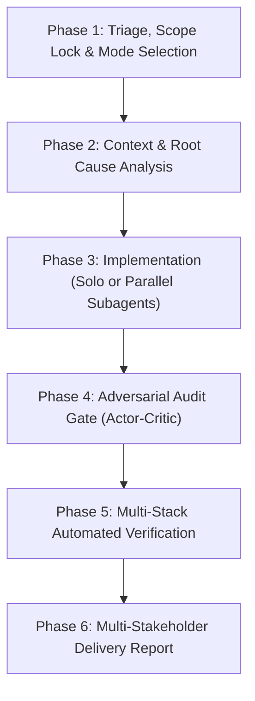

# SKILL: Universal Quick Fix & Rapid Improvement Protocol (v3.0.0)

## 🎯 Mục đích & Phạm vi

Skill này quy định quy trình xử lý chuẩn hóa cho các tác vụ **Quick Fix & Cải tiến nhanh** (sửa lỗi, chỉnh sửa hành vi, tinh chỉnh UI, refactor nhỏ). Quy trình thiết kế theo chuẩn **Multi-Perspective & Multi-Stack AI Workflow** nhằm giúp mọi AI Coding Agent (Antigravity, Claude, Cursor, Codex, Copilot...) tự động tuân thủ nguyên tắc chất lượng cao nhất trên **BẤT KỲ NGÔN NGỮ / TECH STACK NÀO** mà không bị quá tải bởi các quy trình spec rườm rà.

---

## 🚦 Ma trận Quyết định Scope (Scope Decision Matrix)

AI **PHẢI** kiểm tra điều kiện trước khi thực hiện tác vụ:

| Tiêu chí | ✅ Dùng `quick-fix` | 🛑 CHUYỂN SANG FEATURE SPEC (`feature-spec`) |
| :--- | :--- | :--- |
| **Số lượng file thay đổi** | Tối đa **1–5 files** | > 5 files hoặc thay đổi nhiều layer lớn |
| **Bản chất tác vụ** | Fix bug cụ thể, sửa logic sai, UI tweak, minor UX | Thêm tính năng mới, tạo màn hình mới |
| **Cơ sở dữ liệu / Schema** | Không đổi schema / DB migration phức tạp | Có DB Migration / Thay đổi Schema lớn |
| **API Contract** | Giữ nguyên hoặc mở rộng tương thích ngược (Non-breaking) | Đổi Breaking API Contract |
| **Rủi ro ảnh hưởng** | Cục bộ hoặc liên kết 2 bên (Cross-repo fix) | Tái cấu trúc toàn hệ thống (System-wide revamp) |

---

## 🤖 Ma trận Chế độ Thực thi: Solo Fast Mode vs Multi-Agent Swarm Mode

Để khắc phục hiện tượng **Thiên kiến xác nhận (Confirmation Bias)** và **Nghẽn cổ chai ngữ cảnh (Context Bloat)**, AI tự động lựa chọn 1 trong 2 chế độ thực thi:

| Tiêu chí phân loại | ⚡ CHẾ ĐỘ 1: SOLO FAST MODE | 🐝 CHẾ ĐỘ 2: MULTI-AGENT SWARM MODE |
| :--- | :--- | :--- |
| **Phạm vi Repository** | **1 Repository duy nhất** | **$\ge$ 2 Repositories** (Cross-Repo: Mobile + Backend, Web + API...) |
| **Độ phức tạp** | Micro bug, linter fix, UI tweak, 1-3 files | Bug hợp đồng API, Race Condition, Concurrency, Lifecycle ngắt quãng |
| **Cơ chế AI** | **1 Agent đơn đóng nhiều vai** (Persona Shifting) | **Actor-Critic Swarm Architecture** (Điều phối đa đặc vụ) |
| **Ưu điểm** | Tốc độ tức thì (< 1 phút), siêu tiết kiệm token | Triệt tiêu thiên kiến xác nhận, chạy song song, context cô đọng |
| **Công cụ kích hoạt** | Tool thông thường (`replace_file_content`, `run_command`) | `invoke_subagent`, `manage_subagents`, `send_message` |

---

## 🐝 Kiến trúc Đa Đặc vụ (Multi-Agent Swarm & Actor-Critic Architecture)

Khi kích hoạt **Multi-Agent Swarm Mode**, hệ thống vận hành theo mô hình phân tầng chặt chẽ:

```
                                ┌────────────────────────────────────────┐
                                │     👑 1. SUPERVISOR / TRIAGE AGENT    │
                                │   Khóa Scope • API Contract • Routing  │
                                └───────────────────┬────────────────────┘
                                                    │
                 ┌──────────────────────────────────┴──────────────────────────────────┐
                 │ dispatch song song (`invoke_subagent`)                              │ dispatch song song (`invoke_subagent`)
     ┌───────────▼──────────────┐                                          ┌───────────▼──────────────┐
     │ 💻 2A. SUBAGENT: BACKEND │                                          │ 📱 2B. SUBAGENT: CLIENT  │
     │ Workspace: Server/API    │                                          │ Workspace: Mobile/Web    │
     │ Sửa code & chạy test     │                                          │ Sửa code & chạy test     │
     └───────────┬──────────────┘                                          └───────────┬──────────────┘
                 │                                                                     │
                 └──────────────────────────────────┬──────────────────────────────────┘
                                                    │ Bàn giao Git Diff chéo
                                         ┌──────────▼──────────┐
                                         │  🧐 3. CRITIC AGENT │
                                         │ (Adversarial Review)│
                                         │ Soi lỗi chéo 2 bên  │
                                         │ Bắt race condition  │
                                         └──────────┬──────────┘
                                                    │ APPROVED
                                         ┌──────────▼──────────┐
                                         │  📦 4. DELIVERY     │
                                         │ Báo cáo đa chiều    │
                                         └─────────────────────┘
```

### 👥 Phân định Vai trò Trong Swarm:
1. 👑 **Supervisor Agent (Parent Agent):**
   - Tiếp nhận bug report, phân tích root cause liên hệ thống, thiết lập API Contract chuẩn mực.
   - Chia nhỏ task và điều phối song song cho các Domain Subagents qua `invoke_subagent`.
   - Giữ context sạch sẽ, không bị phình to bởi các log trung gian.
2. 💻 **Domain Specialist Subagents (Actors):**
   - **Backend Worker:** Chuyên sâu vào API, DB ORM, Job Queue, chạy test suite server (`pytest`, `go test`, `mvn test`...).
   - **Client Worker:** Chuyên sâu vào Mobile (Swift, Kotlin, React Native) hoặc Web UI, xử lý event, state store, chạy type-check (`tsc`) và UI test.
   - Làm việc trong workspace độc lập, sửa code theo chuẩn Minimal Diff.
3. 🧐 **Adversarial Critic Subagent (Reviewer & Security/QA Lead):**
   - **QUY TẮC BẤT DI BẤT DỊCH:** Critic **KHÔNG THAM GIA VIẾT CODE**, đóng vai trò phản biện độc lập.
   - Nhiệm vụ duy nhất: Tìm ra lỗ hổng, race condition, data loss, lỗi lệch contract giữa 2 bên, và hiện tượng "vá triệu chứng".
   - Chỉ khi Critic cấp quyền **PASS**, Supervisor mới cho phép commit/merge.

---

## 👥 5 Góc nhìn Vai trò Cốt lõi (Multi-Role Perspectives)

Mọi thay đổi code (dù chạy Solo hay Multi-Agent) phải đáp ứng đồng thời 5 tiêu chuẩn vai trò:

```
                  ┌────────────────────────────────────────┐
                  │ 👔 1. QUẢN LÝ (Project Manager / PM)  │
                  │ Scope Lock • DoD • Zero Scope Creep    │
                  └──────────────────┬─────────────────────┘
                                     │
    ┌────────────────────────────────┼────────────────────────────────┐
    │                                │                                │
┌───┴───────────────────────┐ ┌──────┴──────────────────────┐ ┌───────┴──────────────────────┐
│ 💻 2. LẬP TRÌNH VIÊN      │ │ 🧪 3. TESTER / QC           │ │ 🎨 4. DESIGNER / UX          │
│ Root Cause • Minimal Diff │ │ Regression Check • Proof    │ │ Visual & UX Consistency      │
│ No Symptom Patching       │ │ Empirical Verification      │ │ Platform Guidelines          │
└───┬───────────────────────┘ └──────┬──────────────────────┘ └───────┬──────────────────────┘
    │                                │                                │
    └────────────────────────────────┼────────────────────────────────┘
                                     │
                  ┌──────────────────┴─────────────────────┐
                  │ 🤝 5. KHÁCH HÀNG / STAKEHOLDER         │
                  │ Business Value • Transparent Report    │
                  └────────────────────────────────────────┘
```

1. 👔 **Quản lý (PM/Scrum Master):** Khóa phạm vi (Scope Lock), đảm bảo hoàn thành nhanh, không "tiện tay" sửa lan sang phần khác (Scope Creep), báo cáo tiến độ minh bạch.
2. 💻 **Lập trình viên (Developer/Tech Lead):** Phân tích nguyên nhân gốc (Root Cause First), không "vá víu" triệu chứng (No Symptom Patching), giữ nguyên kiến trúc và style code của dự án.
3. 🧪 **Tester / QC:** Đảm bảo không nảy sinh lỗi cũ (Zero Regression), tự kiểm thử bằng bằng chứng thực tế (Empirical Proof), kiểm tra các trường hợp biên (Edge cases).
4. 🎨 **Designer / UX:** Đảm bảo tính nhất quán giao diện (Visual & UX Consistency), phản hồi mượt mà, không làm vỡ layout responsive hay màu sắc chuẩn của Design System.
5. 🤝 **Khách hàng (Stakeholder):** Đảm bảo giá trị sử dụng không bị ảnh hưởng tiêu cực, nhận báo cáo dễ hiểu bằng ngôn ngữ tự nhiên (non-technical summary).

---

## 🔄 Quy trình 6 Bước Thực thi (6-Phase Execution Pipeline)


```mermaid
graph TD
    P1["Phase 1: Triage, Scope Lock & Mode Selection"] --> P2["Phase 2: Context & Root Cause Analysis"]
    P2 --> P3["Phase 3: Implementation (Solo or Parallel Subagents)"]
    P3 --> P4["Phase 4: Adversarial Audit Gate (Actor-Critic)"]
    P4 --> P5["Phase 5: Multi-Stack Automated Verification"]
    P5 --> P6["Phase 6: Multi-Stakeholder Delivery Report"]
```

---

### 📍 PHASE 1: Triage, Scope Lock & Mode Selection (Phân loại & Chọn Chế độ)

AI tự động xác định loại tác vụ, thiết lập ranh giới và chọn chế độ thực thi:

1. **Phân loại tác vụ:**
   - 🐛 **Bug Fix:** Lỗi crash, logic sai, tính toán sai, đồng bộ dữ liệu lỗi.
   - 🔧 **Code Repair:** Lỗi type error, linter, import hỏng, deprecation.
   - 🎨 **UI/UX Tweak:** Chỉnh style, layout, responsive, spacing, text.
   - ♻️ **Micro Refactor:** Tối ưu hiệu năng nhỏ, đơn giản hóa đoạn code rối (dưới 100 dòng).
2. **Thiết lập ranh giới (Scope Boundary):**
   - Xác định danh sách các file được phép sửa (Target Files).
   - Đánh dấu các file **CẤM** đụng vào để tránh side-effect.
3. **Kiểm tra Cô lập Nhánh (Branch Isolation & Git Governance Checkpoint):**
   > [!CAUTION]
   > **TUÂN THỦ [RULE-GIT-001] — CẤM SỬA CHUNG NHÁNH VỚI BUG KHÔNG LIÊN QUAN:**
   > - Trước khi sửa bất kỳ dòng code nào, AI phải kiểm tra branch hiện tại (`git branch --show-current`).
   > - Nếu nhánh hiện tại đang thuộc về một bug/feature khác KHÔNG LIÊN QUAN:
   >   1. `git stash` hoặc commit hoàn tất phần việc cũ.
   >   2. Chuyển về base (`develop`): `git checkout develop && git pull origin develop`.
   >   3. Tạo nhánh mới riêng biệt: `git checkout -b fix/<kebab-case-topic>`.
   >   4. Tiến hành sửa trên nhánh mới đó, tuyệt đối không commit đè lên nhánh cũ.
4. **Lựa chọn Chế độ Thực thi:**
   - Nếu tác vụ liên quan đến $\ge 2$ repo/workspace hoặc logic phân tán Client-Server $\rightarrow$ Chọn **Multi-Agent Swarm Mode**.
   - Nếu tác vụ cục bộ trong 1 repo duy nhất $\rightarrow$ Chọn **Solo Fast Mode**.
5. **Xác nhận & Làm rõ Yêu cầu (Requirement Alignment Checkpoint):**
   - **Trường hợp A (Yêu cầu rõ ràng, đủ thông tin):** Tóm tắt ngắn gọn ranh giới công việc và tự động chuyển sang Phase 2.
   - **Trường hợp B (Yêu cầu mập mờ, thiếu thông tin hoặc có nhiều phương án giải quyết):**
     > [!CAUTION]
     > **CẤM ĐOÁN MỜ & CẤM TỰ SỬA KHI THIẾU THÔNG TIN:**
     > AI **PHẢI DỪNG LẠI HỎI NGƯỜI DÙNG** để làm rõ trước khi đụng vào code. Đặt tối đa 1–3 câu hỏi tập trung kèm giải pháp `(Recommended)`.

---

### 📍 PHASE 2: Deep Context & Root Cause Analysis (Điều tra Nguyên nhân Gốc)

> [!IMPORTANT]
> **TẮT CƠ CHẾ ĐOÁN MỜ / MASKING SYMPTOM:**
> Không bao giờ sửa code khi chưa đọc hiểu file thực tế. Không sử dụng try-catch rỗng để nuốt lỗi hay trả về dummy fallback.

1. **Thu thập thông tin:**
   - Đọc kỹ log lỗi, stack trace, hoặc mô tả bug của người dùng.
   - Đọc các file liên quan bằng lệnh xem file đầy đủ (không đọc lướt 15-20 dòng đầu).
2. **Xác định Root Cause Matrix:**
   - **Hiện tượng (Symptom):** [Lỗi hiển thị hoặc crash như thế nào?]
   - **Nguyên nhân gốc (Root Cause):** [Dòng code nào, hàm nào, hoặc logic nào thực sự gây ra lỗi?]
   - **Rủi ro tiềm ẩn (Risk):** [Thay đổi này có thể tác động đến component/module nào khác?]

---

### 📍 PHASE 3: Implementation (Thực thi Code Chuẩn xác)

1. **Nguyên tắc sửa code:**
   - **Minimal Diff:** Chỉ sửa đúng những dòng code cần thiết để khắc phục Root Cause.
   - **Pattern Matching:** Tuân thủ 100% naming convention, indent, import pattern và coding style hiện có của dự án.
   - **No Unused Code:** Không để lại `console.log`, `print()`, code comment thừa, hoặc import không dùng.
2. **Điều phối theo Chế độ:**
   - **Solo Mode:** Thực hiện chỉnh sửa trực tiếp bằng các khối edit tập trung.
   - **Multi-Agent Swarm Mode:** Supervisor gọi `invoke_subagent` giao việc cụ thể cho từng Subagent Worker trên từng repo, kèm theo Contract đã thống nhất ở Phase 2.

---

### 📍 PHASE 4: Adversarial Audit Gate (Tự Review & Phản biện Độc lập)

> [!IMPORTANT]
> **TRIỆT TIÊU THIÊN KIẾN XÁC NHẬN (CONFIRMATION BIAS):**
> Sau khi sửa code xong, AI **KHÔNG ĐƯỢC TUYÊN BỐ HOÀN THÀNH NGAY**.

- **Trong Solo Mode:** AI tự đóng vai **Senior Code Reviewer / QC Lead** soi lại git diff theo 4 ma trận kiểm định bên dưới.
- **Trong Multi-Agent Mode:** Supervisor điều phối **Critic Subagent** độc lập để thực hiện kiểm toán chéo (Adversarial Review).

#### 🛡️ 4 Ma trận Kiểm định Bắt buộc:
1. **Đối chiếu Yêu cầu Ban đầu (Requirements Traceability Matrix):**
   - Rà soát lại 100% các mục yêu cầu trong lời gọi của người dùng / ticket.
   - ❓ *Từng yêu cầu đã được đáp ứng đầy đủ chưa? Có mục nào bị bỏ sót hay làm sai lệch không?*
2. **Tự Code Review (`git diff` Self-Review):**
   - Đọc lại toàn bộ đoạn code vừa thay đổi.
   - ❓ *Có để lại `console.log`, `print()`, code comment rác hoặc import dư thừa không?*
   - ❓ *Có đoạn code nào tiềm ẩn rủi ro NullPointer / KeyError / ReferenceError / Memory Leak không?*
3. **Phân tích Hợp đồng & Tác động (Contract & Impact Assessment):**
   - ❓ *Response schema của Backend có khớp 100% với model giải mã của Mobile/Frontend không?*
   - ❓ *Có làm thay đổi hành vi (behavior) của các tính năng không liên quan khác không?*
4. **Kịch bản Trường hợp Biên & Bất đồng bộ (Concurrency & Edge-Case Checklist):**
   - ❓ *Đã xử lý an toàn tính lũy đẳng (Idempotency) khi gọi lặp lại (double-call, retry) chưa?*
   - ❓ *Đã xử lý trường hợp kill app, mạng yếu, ngắt kết nối giữa chừng, đổi trạng thái chưa?*

---

### 📍 PHASE 5: Multi-Stack Automated Verification Gate (Kiểm thử Tự động Đa Hệ thống)

AI **BẮT BUỘC** tự động phát hiện Tech Stack của dự án và chạy các lệnh kiểm thử tương ứng. Trong Multi-Agent Mode, các lệnh kiểm thử được chạy **song song** trên từng môi trường dự án.

#### 🔍 1. Ma trận Lệnh Kiểm thử Theo Tech Stack:

| Tech Stack / Ecosystem | 1. Biên dịch & Type-Check | 2. Linter & Static Analysis | 3. Unit & Regression Test |
| :--- | :--- | :--- | :--- |
| **Node.js / TS / React / Next / Vue** | `npm run type-check` (hoặc `tsc --noEmit`) | `npm run lint` (hoặc `npx eslint .`) | `npm test` (hoặc `npx vitest` / `jest`) |
| **Python (Django / FastAPI / Flask)** | `mypy .` (hoặc `pyright`) | `ruff check .` (hoặc `flake8`) | `pytest` (hoặc `python manage.py test`) |
| **Java / Kotlin (Spring / Android)** | `./gradlew compileJava` (hoặc `mvn compile`) | `./gradlew checkstyle` (hoặc `mvn spotbugs:check`) | `./gradlew test` (hoặc `mvn test`) |
| **C# / .NET (ASP.NET / Unity)** | `dotnet build` | `dotnet format --verify-no-changes` | `dotnet test` |
| **Go (Golang)** | `go build ./...` | `go vet ./...` (hoặc `golangci-lint run`) | `go test -v ./...` |
| **Rust** | `cargo check` | `cargo clippy` | `cargo test` |
| **C / C++** | `cmake --build build` (hoặc `make`) | `cppcheck .` (hoặc `clang-tidy`) | `ctest` |
| **iOS / Swift** | `xcodebuild build` | `swiftlint` | `xcodebuild test` |
| **PHP (Laravel / Symfony)** | `vendor/bin/phpstan` | `vendor/bin/phpcs` | `php artisan test` (hoặc `phpunit`) |

#### 🔄 2. Vòng lặp Tự sửa Lỗi Kiểm thử (Auto-Remediation Loop):
Nếu bất kỳ lệnh verify nào thất bại (Exit Code $\neq$ 0):
1. Đọc trực tiếp log lỗi thực tế.
2. Phân tích nguyên nhân gốc và điều chỉnh code chính xác.
3. Chạy lại lệnh verify đến khi đạt **100% Pass / Green**.

#### 📱 3. Kịch bản Kiểm thử Thủ công Bắt buộc (Manual Verification Protocol):
Khi tác vụ có tương tác trực tiếp của người dùng hoặc thuộc nhóm Frontend/Mobile/UI/Integration:
AI **BẮT BUỘC** phải cung cấp **Hướng dẫn Kiểm thử Thủ công (Manual Verification Steps)** chi tiết trong Báo cáo Bàn giao (Phase 6), gồm:
1. **Mục tiêu & Điều kiện kiểm thử:** Môi trường, tài khoản, màn hình kiểm tra.
2. **Các bước thao tác từng bước (Step-by-step):** Đánh số rõ ràng (Bước 1, Bước 2, Bước 3...).
3. **Kết quả kỳ vọng chi tiết (Expected Result):** Cho từng thao tác, nêu rõ điểm khác biệt sau khi fix.
4. **Các trường hợp ngoại lệ cần thử (Negative / Edge Cases):** Hủy giữa chừng, mất mạng, đổi tham số, xóa dữ liệu.

---

### 📍 PHASE 6: Multi-Stakeholder Delivery Report (Báo cáo Bàn giao Đa Chiều)

Sau khi hoàn thành và verify thành công, AI tổng hợp báo cáo đa góc nhìn cho người dùng:

```markdown
### 📋 BÁO CÁO HOÀN THÀNH (QUICK FIX REPORT)

#### 👔 1. Quản lý (Scope & DoD)
- **Tech Stack:** [Node.js / Python / Java / Go / C# / C++ / Rust / Swift / PHP]
- **Chế độ thực thi:** [Solo Fast Mode / Multi-Agent Swarm Mode]
- **Git Branch:** `[branch_name]` (Tuân thủ `[RULE-GIT-001]`)
- **Commit Message:** `[type(scope): subject]` (Conventional Commits)
- **Danh sách file đã sửa:** `[file_path_1]`, `[file_path_2]`
- **Trạng thái:** ✅ Hoàn thành đúng Scope, không đụng vào module ngoài.

#### 💻 2. Lập trình viên (Technical Summary & Self-Audit)
- **Root Cause:** [Mô tả ngắn gọn nguyên nhân gốc rễ kỹ thuật]
- **Giải pháp:** [Giải pháp kỹ thuật đã áp dụng]
- **Kết quả Tự Review / Critic Review:** ✅ Đã kiểm toán git diff, loại bỏ rác/log thừa, đảm bảo tính lũy đẳng (idempotent) và no-side-effect.

#### 🧪 3. Tester / QC (Verification Evidence & Traceability)
- **Đối chiếu Yêu cầu:** 100% yêu cầu ban đầu đã được đáp ứng.
- **Kiểm thử tự động:**
  - Build/Type-check: Pass ✅
  - Lint/Static Analysis: Pass ✅
  - Unit/Regression test: Pass ✅
- **Edge cases đã rà soát:** [Ví dụ: null/undefined, mạng chậm, kill app, race condition...]
- **📱 Hướng dẫn Kiểm thử Thủ công (Manual Verification Steps):**
  - **Môi trường & Điều kiện:** [Thiết bị/Trình duyệt, màn hình, tài khoản...]
  - **Bước 1:** [Thao tác mở màn hình/popup...] $\rightarrow$ *Kỳ vọng:* [Hiển thị đúng...]
  - **Bước 2:** [Thao tác tương tác với tính năng đã fix...] $\rightarrow$ *Kỳ vọng:* [Hành vi đúng như yêu cầu...]
  - **Bước 3:** [Thao tác lưu/submit/đối chiếu dữ liệu...] $\rightarrow$ *Kỳ vọng:* [Dữ liệu lưu chuẩn xác, không lỗi...]
  - **Trường hợp ngoại lệ (Edge case):** [Thao tác hủy/bỏ chọn/thử lỗi...] $\rightarrow$ *Kỳ vọng:* [Xử lý an toàn...]

#### 🎨 4. Designer / UX (Visual & Interaction)
- **Tác động UI/UX:** [Ví dụ: Giữ nguyên Layout, nhất quán màu sắc/spacing, không vỡ Responsive]

#### 🤝 5. Khách hàng (Business Impact)
- **Tóm tắt ngắn gọn:** [Mô tả 1-2 câu dễ hiểu về thay đổi này mang lại lợi ích cho người dùng cuối]
```

---

## 🛠️ Hướng dẫn Tích hợp với các AI Agents (Cross-AI Compatibility)

Skill này được thiết kế để tương thích tốt trên nhiều môi trường AI khác nhau:

- **Antigravity / Gemini:** Tự động kích hoạt skill qua đường dẫn `.skill/QUICK_FIX.md` hoặc `.agents/skills/quick-fix/SKILL.md`. Tự động dùng `invoke_subagent` khi phát hiện bài toán Multi-Repo/Fullstack.
- **Claude Desktop / Claude Code:** Đặt file tại `.claude/skills/quick-fix.md` hoặc thêm System Prompt chỉ định tuân thủ quy trình.
- **Cursor / Copilot / Windsurf:** Đặt file tại `.cursorrules` hoặc `.github/copilot-instructions.md` bằng cách quote nội dung ma trận quy trình.
