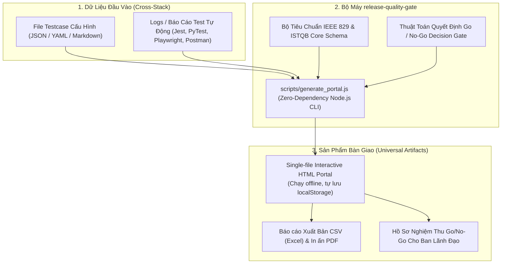

# Universal Release Quality Gate & Interactive Portal Protocol

Kỹ năng này cung cấp giải pháp đóng gói chuẩn hóa để **QA/QC Lead**, **DevOps**, hoặc **AI Agent** tự động thiết lập và vận hành **Cổng Kiểm Soát Phát Hành (Release Gate)** cho bất kỳ dự án công nghệ nào (Node.js, Python, Go, Java, PHP, Mobile App, Microservices, AI/ML System).

---

## 1. Triết Lý & Kiến Trúc Thiết Kế (Universal Architecture)

Portal kiểm thử và cổng duyệt phát hành được thiết kế theo tư duy **Zero-Dependency & Decoupled State**:



### Các Đặc Điểm Vượt Trội:
1. **Single-File Zero Dependency**: File HTML sinh ra hoàn toàn độc lập, sử dụng CDN Tailwind CSS và FontAwesome, không cần dựng web server hay backend. Mở trực tiếp bằng Chrome, Edge, Safari hoặc in PDF.
2. **Cơ Chế Lưu Trữ Kép (Dual Persistence)**:
   - Tự động lưu tiến độ kiểm thử vào `localStorage` trình duyệt theo phiên bản và tên dự án.
   - Hỗ trợ nút `Backup JSON` và `Restore JSON` để chuyển giao phiên test giữa các thành viên QA/Dev.
3. **Go/No-Go Decision Engine**:
   - Tự động hiển thị huy hiệu: `READY FOR PRODUCTION RELEASE` nếu **100% Blocker (P0) PASSED** và tỷ lệ Pass $\ge 90\%$.
   - Tự động cảnh báo đỏ: `RELEASE BLOCKED` nếu còn bất kỳ lỗi P0 hoặc ca kiểm thử thất bại.
4. **Phân Tách Môi Trường (Dual-Environment)**:
   - Gắn nhãn rõ ràng: `Local`, `Staging`, `Prod`, `Safe Prod` để ngăn chặn rủi ro chạy nhầm ca test ghi phá hủy dữ liệu (mutation) lên Production.

---

## 2. Cấu Trúc Schema Dữ Liệu Chuẩn (Universal ISTQB Schema)

Bất kỳ dự án nào cũng chỉ cần cung cấp 1 file JSON theo cấu trúc sau:

```json
{
  "projectName": "Tên Dự Án (VD: CRM E-Commerce Platform)",
  "version": "1.2.0",
  "releaseDate": "2026-10-01",
  "targetDomain": "https://app.example.com",
  "checklistSections": [
    {
      "id": "infra",
      "title": "Hạ tầng & DevOps",
      "items": [
        { "id": "CHK-01", "name": "DB Migrations đã chạy thành công", "env": "prod", "checked": false }
      ]
    }
  ],
  "testCases": [
    {
      "id": "AUTH-01",
      "module": "Authentication",
      "priority": "P0",
      "title": "Đăng nhập với Google OAuth 2.0",
      "preconditions": "Tài khoản Google hợp lệ",
      "steps": "1. Bấm Đăng nhập Google\n2. Chọn email @company.com",
      "expected": "Cấp JWT Cookie và chuyển hướng vào trang chính trong < 2s",
      "actual": "",
      "status": "PASSED",
      "environment": "Prod",
      "isBlocker": true,
      "evidence": "HTTP 200 OK - Redirect /dashboard (duration 240ms)"
    }
  ]
}
```

---

## 3. Cách Sử Dụng Cho Một Dự Án Bất Kỳ

### Cách 1: Khởi Tạo Portal Từ File JSON Mẫu
Khi chuẩn bị đợt Release mới trong bất kỳ thư mục dự án nào:
```bash
node ~/.gemini/config/skills/release-quality-gate/scripts/generate_portal.js \
  --input=./testcases.json \
  --output=./Release_Quality_Gate.html
```

### Cách 2: Tự Động Ghép Bằng Chứng Từ Test Tự Động (Evidence Merge)
Nếu dự án có chạy test tự động (Jest, PyTest, Playwright) xuất ra file JSON kết quả:
```bash
node ~/.gemini/config/skills/release-quality-gate/scripts/generate_portal.js \
  --input=./testcases.json \
  --evidence=./reports/test-results.json \
  --output=./Release_Quality_Gate.html
```
*Script sẽ tự động so khớp `id` của testcase, cập nhật trạng thái `PASSED/FAILED` và điền chi tiết `evidence` vào portal.*

### Cách 3: Yêu Cầu AI Trực Tiếp Thực Hiện
Chỉ cần chat với Agent:
> *"Hãy áp dụng skill release-quality-gate để tạo bảng kiểm thử nghiệm thu release cho dự án này."*

Agent sẽ:
1. Đọc kiến trúc và các API/tính năng trong repository hiện tại.
2. Tự động soạn thảo danh sách testcase toàn diện phân loại theo P0/P1/P2.
3. Chạy lệnh sinh file HTML Portal ngay tại thư mục gốc của dự án.

---

## 4. Quy Trình 5 Bước Nghiệm Thu Phát Hành (Release Gate Workflow)

| Bước | Người Thực Hiện | Thao Tác | Tiêu Chí Đầu Ra |
|---|---|---|---|
| **1. Khởi tạo Ma trận** | QA Lead / AI Agent | Soạn thảo danh sách testcase cho phiên bản sắp phát hành. | File `testcases.json` đầy đủ các module và mức độ ưu tiên. |
| **2. Sinh Portal** | CI/CD hoặc Developer | Chạy script `generate_portal.js`. | File `Release_Quality_Gate.html` sẵn sàng. |
| **3. Thực thi Kiểm thử** | QA Team & Automation | Chạy tự động và kiểm thử thủ công trên Staging/Prod. Đánh dấu trạng thái trên UI portal. | Cập nhật kết quả, bằng chứng hình ảnh/log. |
| **4. Đánh giá Go/No-Go** | QA Lead & Tech Lead | Kiểm tra huy hiệu Go/No-Go trên đỉnh portal. | Không còn P0 Blocker tồn đọng, tỷ lệ pass $\ge 90\%$. |
| **5. Lưu vết & Ký duyệt** | Release Manager | Bấm nút **Xuất CSV** và **In / Xuất PDF**. | Đính kèm file PDF/CSV vào Jira/GitLab Release Tag. |

---

## 5. Hướng Dẫn Vận Hành Portal HTML Cho Đội Ngũ QA

- **Bộ lọc đa chiều**: Lọc tức thì theo Ô tìm kiếm, Mức độ ưu tiên (`P0 Blocker`, `P1`, `P2`, `P3`), Môi trường (`Prod`, `Staging`, `Local`), Phân hệ nghiệp vụ.
- **Cập nhật nhanh**: Thay đổi trạng thái (`PASS`, `FAIL`, `BLOCK`, `UNTESTED`) trực tiếp trên dropdown, gõ ghi chú thực tế vào ô input $\rightarrow$ Tự động lưu tức thì vào trình duyệt.
- **Xuất dữ liệu**:
  - `Xuất CSV (Excel)`: Tạo file `.csv` định dạng chuẩn UTF-8 BOM, mở trực tiếp bằng Microsoft Excel không bao giờ bị lỗi font tiếng Việt.
  - `Backup JSON`: Tải file `.json` chứa toàn bộ tiến độ test để gửi cho đồng nghiệp hoặc lưu trữ.
  - `Restore JSON`: Nạp lại trạng thái đã test trước đó trên máy tính khác.
  - `In / Xuất PDF`: Chế độ tối ưu trang in tự động ẩn thanh công cụ, chia trang thông minh cho biên bản nghiệm thu.
