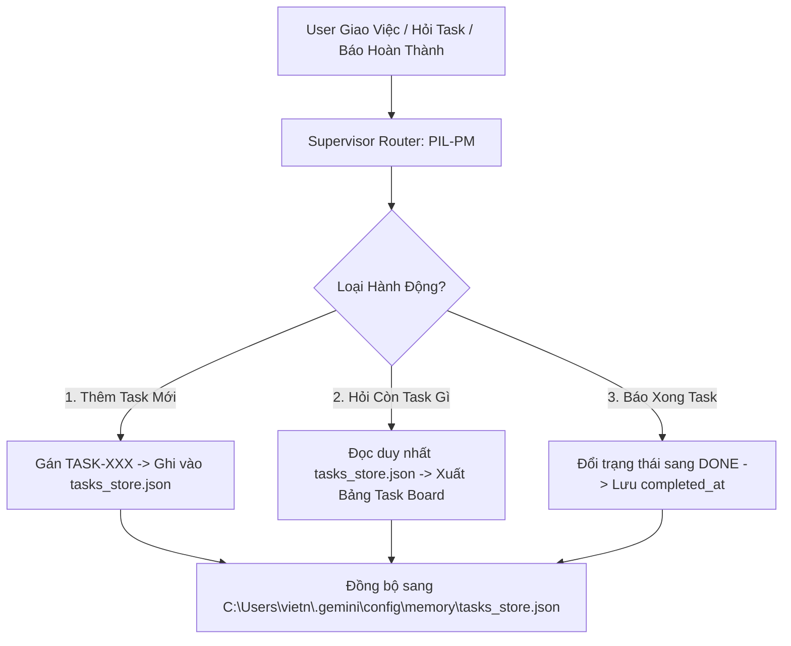

# [SKILL-PM-003] Task Lifecycle Manager: Persistent State & Fast Retrieval Engine

Skill này chuyên trách ghi nhận, theo dõi, truy xuất và cập nhật trạng thái mọi task/nhiệm vụ được User yêu cầu trên toàn bộ các phiên làm việc và dự án.



---

## 🛠️ 3 Chế Độ Hoạt Động (Operations)

### 1. Thêm Task Mới (Create / Ingest Task)
- Tự động sinh `task_id` kế tiếp: `TASK-001`, `TASK-002`...
- Cấu trúc 1 record chuẩn trong `tasks_store.json`:
  ```json
  {
    "task_id": "TASK-001",
    "title": "Thiết kế API Authentication",
    "project": "ITGVietAssistant",
    "category": "DEV",
    "priority": "P1-HIGH",
    "status": "TODO",
    "created_at": "2026-10-06T08:50:00Z",
    "completed_at": null,
    "acceptance_criteria": ["Hash password bằng bcrypt", "Cấp phát JWT token"],
    "notes": "Yêu cầu từ User"
  }
  ```

### 2. Truy Vấn Siêu Tốc (Fast Query: "Tôi còn task gì?")
- **Tối ưu Token & Tốc độ**: Chỉ đọc file `tasks_store.json`.
- Lọc danh sách `status != "DONE"`.
- Trả về Bảng Kanban Markdown cô đọng:

| Mã Task | Tiêu Đề | Dự Án | Ưu Tiên | Trạng Thái | Tiêu Chí Nghiệm Thu (AC) |
| :---: | :--- | :---: | :---: | :---: | :--- |
| `TASK-001` | Thiết kế API Auth | `ITGVietAssistant` | 🔴 `P1-HIGH` | ⏳ `IN_PROGRESS` | Cấp phát JWT token |
| `TASK-002` | Audit bảo mật DB | `NCManagement` | 🟡 `P2-MEDIUM` | 📋 `TODO` | Rà soát Firestore rules |

### 3. Cập Nhật Khi Hoàn Thành (State Transition: "Task X xong rồi")
- Tìm `task_id` được nhắc đến.
- Đổi `status` thành `DONE`, ghi nhận `completed_at: <current_timestamp>`.
- Phản hồi xác nhận và hiển thị ngay các task kế tiếp còn tồn đọng.
