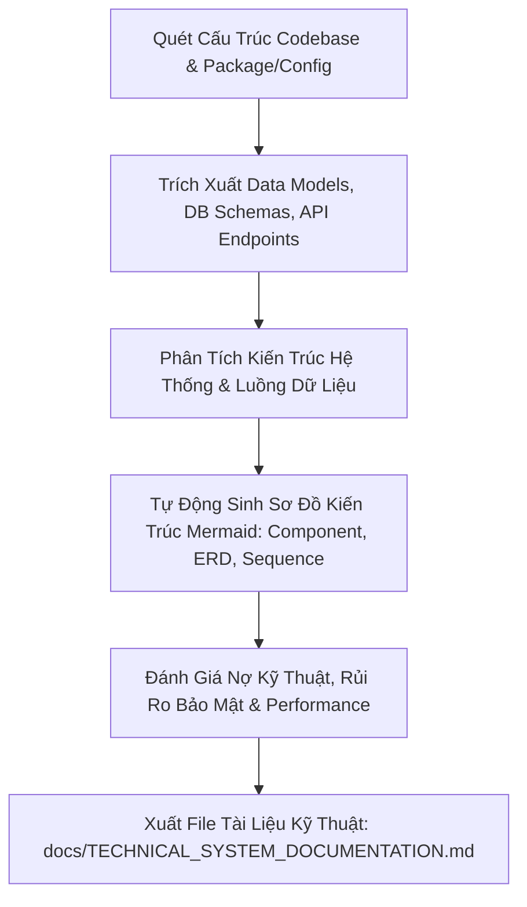

# [SKILL-LEAD-003] Tech Doc Generator: System & Source Code Reverse-Engineering Engine

Skill này chịu trách nhiệm khảo sát toàn diện một dự án phần mềm có sẵn, rà soát mã nguồn (Codebase Review) và tự động tạo ra một bộ **Tài Liệu Kỹ Thuật Hệ Thống (System Architecture Document - SAD / Technical Specification)** đạt tiêu chuẩn doanh nghiệp.



---

## 🛠️ Quy Trình 5 Bước Khảo Sát & Xuất Tài Liệu

### Bước 1: Quét Bản Đồ Dự Án (Codebase Topology Mapping)
- Xác định Tech Stack: Ngôn ngữ (TypeScript, Python, Java, Go, C#), Frameworks (React, Next.js, NestJS, FastAPI, Spring Boot...).
- Lập bản đồ cấu trúc thư mục (Directory Tree) và phân vùng trách nhiệm (Layered / Hexagonal / Clean Architecture).
- Kiểm tra các file cấu hình môi trường, Dockerfile, CI/CD pipelines.

### Bước 2: Trích Xuất Mô Hình Dữ Liệu & API (Data Model & Endpoint Extraction)
- **Database & Schemas**: Quét Prisma, TypeORM, SQLAlchemy, Mongoose, SQL Migrations hoặc Firestore rules $\rightarrow$ Tự động sinh **sơ đồ ERD (Entity Relationship Diagram)** bằng Mermaid.
- **API Catalog**: Liệt kê toàn bộ REST/GraphQL/gRPC endpoints (HTTP Method, Route, Input DTO, Response, Auth Protection).

### Bước 3: Phân Tích Luồng Nghiệp Vụ & Kiến Trúc (Architecture & Flow Modeling)
- Vẽ **Sơ đồ Kiến trúc Tổng thể (High-Level Architecture / Component Diagram)**.
- Vẽ **Sơ đồ Tuần tự (Sequence Diagram)** cho luồng nghiệp vụ cốt lõi (ví dụ: Auth, Checkout, Data Processing).
- Phân tích cơ chế Xác thực & Phân quyền (Authentication / Authorization: JWT, OAuth2, RBAC).

### Bước 4: Đánh Giá Sức Khỏe Mã Nguồn (Code Quality & Technical Debt Review)
- Rà soát điểm nghẽn hiệu năng (N+1 queries, memory leak, unindexed queries).
- Rà soát lỗ hổng an ninh cơ bản (OWASP Top 10, Secrets exposure, missing input validations).
- Tổng hợp danh mục Nợ kỹ thuật (Technical Debt) và khuyến nghị tái cấu trúc.

### Bước 5: Biên Soạn & Xuất Tài Liệu (Document Generation)
Xuất ra file tài liệu hoàn chỉnh tại `docs/TECHNICAL_SYSTEM_DOCUMENTATION.md` với khung chuẩn 8 chương (Chi tiết xem mẫu bên dưới).

---

## 📋 Cấu Trúc Khung Chuẩn Của Tài Liệu Kỹ Thuật Đầu Ra

File được xuất ra tại `docs/TECHNICAL_SYSTEM_DOCUMENTATION.md` gồm 8 phần chính:

```markdown
# Tài Liệu Kỹ Thuật Hệ Thống (System Architecture Document - SAD)
**Dự Án**: [Tên Dự Án] | **Ngày Xuất**: [YYYY-MM-DD] | **Lead Reviewer**: Antigravity [PIL-LEAD]

## 1. Tổng Quan Hệ Thống & Bối Cảnh Nghiệp Vụ (System Overview)
- Mục đích dự án, đối tượng người dùng, phạm vi chức năng chính.

## 2. Công Nghệ & Tech Stack (Technology Stack)
- Frontend, Backend, Database, Caching, Cloud/DevOps, Thư viện bên thứ ba quan trọng.

## 3. Kiến Trúc Hệ Thống & Sơ Đồ Thành Phần (System Architecture & Component Diagrams)
- Sơ đồ C4 Model / Component Diagram vẽ bằng Mermaid.
- Mô tả phân tầng logic (Controller -> Service -> Repository / Data Access).

## 4. Mô Hình Dữ Liệu & Sơ Đồ ERD (Database Schema & ERD)
- Sơ đồ `erDiagram` Mermaid chi tiết các bảng/collections và quan hệ 1-N, N-N.
- Bảng mô tả chi tiết các trường dữ liệu quan trọng.

## 5. Danh Mục Giao Tiếp API (API Specification & Contracts)
- Bảng tổng hợp Endpoints (Method, Path, Auth, Request/Response Payload mẫu).

## 6. Luồng Nghiệp Vụ Cốt Lõi & Sơ Đồ Tuần Tự (Core Business Flows & Sequence Diagrams)
- Sơ đồ `sequenceDiagram` Mermaid mô phỏng các luồng phức tạp nhất.

## 7. Cơ Chế An Ninh, Xác Thực & Vận Hành (Security, Auth & Deployment)
- Cơ chế bảo mật, phân quyền, CORS, Rate Limiting, Logging & Monitoring.
- Quy trình Build, Test và Deploy (CI/CD, Docker, Cloud).

## 8. Đánh Giá Chất Lượng Mã Nguồn & Nợ Kỹ Thuật (Code Review & Technical Debt)
- Các điểm tốt của kiến trúc hiện tại.
- Các rủi ro tiềm ẩn (Performance, Security, Anti-patterns).
- Lộ trình cải tiến & đề xuất hành động ngắn/dài hạn (Roadmap).
```
